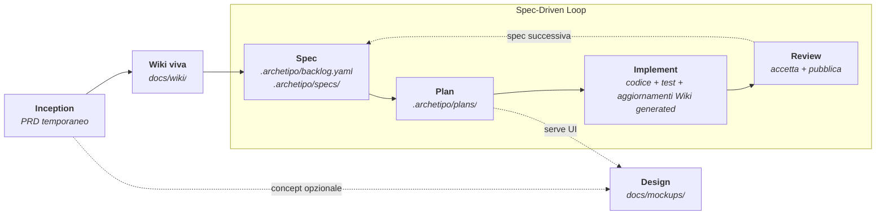

<div align="center">

# ARchetipo

[English](README.md) · **Italiano**

**Da un'idea ancora grezza a codice revisionato, con un team AI che segue un processo vero.**

ARchetipo è un workflow spec-driven per AI coding agent. Dà al tuo assistente un metodo condiviso, artefatti persistenti e ruoli specializzati per discovery, requisiti, architettura, design, implementazione, test e review.

[](#)
[](#licenza)
[](#)
[](#)

[Quickstart](#quickstart) · [Workflow](#workflow) · [Da dove parto](#da-dove-parto) · [CLI](#cli-e-comandi) · [Configurazione](#configurazione) · [FAQ](#faq)

</div>

---

## Perché ARchetipo

Gli AI coding agent sono veloci, ma una risposta veloce a un prompt isolato non è un processo di prodotto. **ARchetipo trasforma l'agente in una squadra disciplinata di sviluppo prodotto**: raccoglie l'intento, scrive specifiche, costruisce backlog, pianifica ogni slice, implementa, testa e lascia artefatti durevoli.

- **Un workflow, non prompt sparsi.** Ogni fase ha una skill, un ruolo, un contratto e un output che alimenta il passo successivo.
- **Spec-driven di default.** Il ciclo `spec -> plan -> implement` si ripete per ogni slice di valore fino al completamento del prodotto.
- **Memoria persistente del progetto.** PRD, backlog, spec, piani, mockup e risultati dei test vivono nel repo o nel connector configurato.
- **Agnostico rispetto al tool.** Lo stesso metodo funziona con Claude Code, Codex, Cursor, Gemini CLI, OpenCode e GitHub Copilot.
- **Auto-detect della lingua.** Le skill adottano la lingua della conversazione: scrivi in italiano, ricevi artefatti in italiano; scrivi in inglese, ricevi artefatti in inglese.

---

## Quickstart

### 1. Installa la CLI una volta sola

```bash
npm install -g @techreloaded/archetipo
```

 se non puoi installare pacchetti npm globali, installa ARchetipo come dipendenza locale del progetto.

```bash
 npm install @techreloaded/archetipo
```

 Poi aggiungi la CLI locale al `PATH` della sessione corrente:

```bash
 # Windows PowerShell
 $env:PATH = "$(Get-Location)\node_modules\.bin;$env:PATH"
 
 # macOS / Linux
 export PATH="$PWD/node_modules/.bin/:$PATH"
```

Dopo, `archetipo init` funziona normalmente.

### 2. Inizializza un progetto

```bash
cd il-mio-progetto
archetipo init

# oppure in modo non interattivo:
archetipo init --tool claude --connector file
```

`archetipo init` copia le skill ARchetipo nella directory del tool AI selezionato, per esempio `.claude/skills/`, `.cursor/skills/` o `.gemini/skills/`, e crea:

- `.archetipo/config.yaml`
- `.archetipo/shared-runtime.md`

Dopo l'inizializzazione, usa le skill `/archetipo-*` dentro il tuo AI coding agent. Le skill invocano la CLI in background quando devono leggere o salvare gli artefatti del workflow.

---

## Workflow

ARchetipo implementa uno Spec-Driven Development supportato dalla Wiki: la conoscenza viva guida ogni incremento e viene aggiornata attraverso `spec -> plan -> implement -> review`.



| Step | Skill | Output | Cosa succede |
|---|---|---|---|
| 1. Discovery | `/archetipo-inception` | `docs/wiki/` | Produce un PRD temporaneo, lo compila in conoscenza viva e lo archivia come fonte. |
| 2. Concept visivo, opzionale | `/archetipo-design` | `docs/mockups/` | Crea mockup HTML/CSS isolati senza toccare il codice applicativo. |
| 3. Backlog | `/archetipo-spec` | `.archetipo/backlog.yaml`, `.archetipo/specs/` | Carica le pagine Wiki pertinenti e crea o estende user story INVEST-compliant. |
| 4. Planning | `/archetipo-plan US-001` | `.archetipo/plans/US-001-plan.yaml` | Produce soluzione tecnica, task ordinati, dipendenze e strategia di test. |
| 5. Code | `/archetipo-implement US-001` | Codice, test, note di review | Esegue il piano, lancia i test, conduce la review e porta la spec verso l'approvazione umana. |
| 6. Accettazione | `/archetipo-review US-001` | Verdetto: `DONE` o feedback di rework | Presenta l'incremento consegnato (criteri, diff, evidenze di test) ed esegue il verdetto umano: approva o rimanda indietro con feedback. |

### Stati workflow

Le spec attraversano stati standardizzati. ARchetipo automatizza il loop, mentre l'accettazione finale resta umana.

| Stato | Significato | Transizione |
|---|---|---|
| `TODO` | Spec presente nel backlog, non ancora pianificata. | Creata da spec |
| `PLANNED` | Pianificazione tecnica completata. | Impostata da plan |
| `IN PROGRESS` | Implementazione avviata. | Impostata da implement |
| `REVIEW` | Code review e test completati; pronta per review umana. | Impostata da implement |
| `DONE` | Spec accettata e rilasciata. | Approvazione umana via `/archetipo-review` |

### Il team AI

Le personas di ARchetipo non sono scena: sono lenti diverse che rendono il processo visibile.

| Persona | Ruolo | Competenza principale |
|---|---|---|
| Andrea | Product Manager | Vision, personas, scope dell'MVP |
| Costanza | Business Strategist | Discovery, posizionamento, ipotesi di prodotto |
| Emanuele | Requirements Analyst | Acceptance criteria, edge case, qualità delle spec |
| Leonardo | Architect | Soluzione tecnica e decisioni architetturali |
| Ugo | Full-Stack Developer | Implementazione e task breakdown |
| Mina | Test Architect | Strategia di test e coverage |
| Cesare | Code Reviewer | Qualità, sicurezza, aderenza al piano |
| Livia | UX Designer | Mockup e linguaggio visivo |

---

## Da dove parto?

Usa questa guida dentro il tuo AI coding agent:

| Domanda | Se la risposta è no | Se la risposta è sì |
|---|---|---|
| Hai già un PRD? | Lancia `/archetipo-inception`. | Continua. |
| Vuoi concept visivi prima dello sviluppo? | Salta design per ora. | Lancia `/archetipo-design`. |
| Hai già un backlog di spec? | Lancia `/archetipo-spec`. | Continua. |
| Le spec sono già `PLANNED`? | Lancia `/archetipo-plan US-001` su una spec `TODO`. | Continua. |
| Una spec è pronta per l'implementazione? | Pianificala prima. | Lancia `/archetipo-implement US-001`. |
| Una spec è in attesa in `REVIEW`? | Implementala prima. | Lancia `/archetipo-review US-001` per accettarla o rimandarla indietro. |

Per lavoro batch, `/archetipo-autopilot` può eseguire plan e implement su più spec eleggibili del backlog, con filtri per epic, priorità, numero massimo di spec o condizioni di stop.

---

## CLI e comandi

ARchetipo usa una CLI deterministica scritta in Go, `archetipo`, per persistenza e operazioni sui connector. Nel flusso normale parli con le skill; sono loro a chiamare questi comandi in background.

| Comando | Scopo |
|---|---|
| `archetipo init` | Installa ARchetipo nel progetto corrente e crea `.archetipo/config.yaml` più `.archetipo/shared-runtime.md`. |
| `archetipo doctor` | Diagnostica l'installazione: data directory, skill nel pacchetto e installate, config di progetto, git e autenticazione gh (connettore github). |
| `archetipo view` | Avvia una board Kanban locale per `.archetipo/backlog.yaml`, `.archetipo/specs/` e `.archetipo/plans/`. |
| `archetipo config show` | Inizializza il connector e stampa i metadati. |
| `archetipo prd write [--file PRD.md]` | Salva il markdown del PRD da `--file` o stdin. |
| `archetipo validate prd [--file PRD.md]` | Valida il PRD contro le regole strutturali del PRD. |
| `archetipo spec list [--status STATUS]` | Legge backlog e metadati riassuntivi, opzionalmente filtrato per stato. |
| `archetipo spec add --file specs.yaml` | Crea o estende il backlog con spec (corpo user-story). |
| `archetipo spec show US-001` | Legge una spec e i suoi task per codice. |
| `archetipo spec next --status TODO` | Seleziona automaticamente la prima spec eleggibile per stato. |
| `archetipo spec plan US-001 --file plan.yaml` | Salva il piano di implementazione e porta la spec in `PLANNED`. |
| `archetipo spec start US-001` | Porta una spec pianificata in `IN PROGRESS`. |
| `archetipo spec review US-001 [--file note.md] [--commit-type feat] [--commit-summary "summary"]` | Porta una spec in `REVIEW`, allega un commento finale e fa un auto-commit dei cambiamenti sporchi della worktree con un soggetto Conventional Commit (default: `chore(US-001): {title}`). |
| `archetipo spec request-changes US-001 --file feedback.json` | Rimanda una spec in `REVIEW` a `TODO` con feedback di rework strutturato aggiunto al corpo. |
| `archetipo spec update US-001 --file patch.yaml` | Applica una patch parziale (title, priority, points, scope, blocked_by, body, epic, rework) a una spec esistente. Supportato su tutti i connector. |
| `archetipo spec integrate US-001` | Fonde il branch worktree di una spec approvata nel base, pulisce e la marca `DONE` (workflow worktree). |
| `archetipo task done US-001 TASK-01` | Marca un task come completato. |
| `archetipo metrics` | Riporta l'avanzamento del backlog: totali, completamento, dettaglio per epic, WIP, rework, spec bloccate e cycle/lead time medi dalla history degli stati. |
| `archetipo spec move US-001 --to review` | Riordina o sposta una spec tra colonne del workflow. |
| `archetipo validate spec --file specs.yaml` | Valida un payload di spec generato senza salvarlo. |
| `archetipo validate plan US-001 --file plan.yaml` | Valida un payload di piano senza cambiare lo stato della spec. |

La CLI legge `.archetipo/config.yaml` dal progetto per scegliere connector attivo e percorsi degli artefatti. Tutti i comandi `archetipo validate ...` restituiscono `kind: "validation_result"` su stdout con `data.ok` a `true` o `false`; gli error envelope restano riservati agli errori di processo.

Per sviluppo locale della CLI senza pubblicare pacchetti npm, vedi [`guides/dev-local-cli.md`](guides/dev-local-cli.md).

### Workflow ibrido per modelli

ARchetipo è ottimizzato per un setup misto. Usa un modello più forte per `/archetipo-inception`, `/archetipo-spec`, `/archetipo-plan` e review sensibili; poi usa un modello più economico o open-weight per `/archetipo-implement`. I task del piano contengono execution contract, e i comandi `validate` bloccano problemi strutturali prima che gli artefatti diventino fonte di verità.

---

## Connector

Le skill non decidono dove vivono gli artefatti. Applicano le regole runtime condivise, invocano comandi CLI espliciti e lasciano al connector configurato la persistenza.

| Connector | Dove vivono gli artefatti | Ideale per |
|---|---|---|
| `file` | File locali sotto `.archetipo/`, più `docs/PRD.md` e `docs/mockups/` | Lavoro individuale, prime fasi di prodotto, workflow offline |
| `github` | GitHub Issues più GitHub Projects v2 | Tracking di team, collaborazione cloud, board di progetto |

### Connector `file`

- Backlog: `.archetipo/backlog.yaml`
- Documenti delle spec: `.archetipo/specs/US-XXX.yaml`
- Piani: `.archetipo/plans/US-XXX-plan.yaml`
- PRD: `docs/PRD.md`
- Mockup: `docs/mockups/`
- Risultati dei test: `docs/test-results/`

Non richiede autenticazione. Tutto resta locale e versionabile.

### Connector `github`

- Gli elementi del backlog diventano issue su una board GitHub Projects v2.
- I task delle spec vengono creati come sub-issue collegate.
- I piani vengono aggiunti al body della issue padre.
- Le transizioni di stato sono gestite tramite campi custom del Project.
- Richiede `gh` CLI autenticato con scope `repo` e `project`.

L'architettura della CLI è estendibile, ma i connector integrati oggi sono `file` e `github`.

---

## Skill

| Skill | Scopo | Trigger tipici |
|---|---|---|
| `archetipo-inception` | Facilita la product discovery e scrive il PRD. | "definisci il prodotto", "idea di prodotto", "scrivi un PRD" |
| `archetipo-design` | Produce mockup frontend isolati in `docs/mockups/`. | "fammi un mockup", "concept dashboard", "landing page" |
| `archetipo-spec` | Crea o estende il backlog a partire dall'intento di prodotto. | "crea il backlog", "aggiungi una spec", "serve una feature per..." |
| `archetipo-plan` | Pianifica una spec con architettura, task, dipendenze e test. | "pianifica US-005", "come lo costruiamo?", "rompi questa spec in task" |
| `archetipo-implement` | Esegue una spec pianificata attraverso codice, test, review e handoff. | "implementa US-005", "esegui la prossima spec pronta" |
| `archetipo-review` | Facilita il gate di accettazione umano: approva verso `DONE` o rimanda indietro con feedback di rework. | "review US-005", "accetta la spec", "cosa c'è in attesa di review?" |
| `archetipo-autopilot` | Esegue planning e implementazione su più spec eleggibili. | "fai tutto", "autopilot del backlog", "implementa tutte le spec" |
| `archetipo-wiki` | Costruisce una mappa DDD codebase-first di domini, bounded context candidati, relazioni logiche e ownership fisica di codice e test. | "inizializza la Wiki", "mappa i domini", "aggiorna la conoscenza" |

---

## Configurazione

`.archetipo/config.yaml` definisce connector, percorsi e stati del workflow. Le chiavi mancanti vengono completate con i default ufficiali.

```yaml
connector: file   # file | github

paths:
  prd: docs/PRD.md
  backlog: .archetipo/backlog.yaml   # solo connector file
  planning: .archetipo/plans/
  mockups: docs/mockups/
  test_results: docs/test-results/

workflow:
  statuses:
    todo: TODO
    planned: PLANNED
    in_progress: IN PROGRESS
    review: REVIEW
    done: DONE   # gate umano: solo /archetipo-review porta una spec qui, dopo approvazione esplicita

github:
  # owner: auto-detected from repo
  # project_number: auto-detected from repo
```

---

## Filosofia

- **Il team è una lente, non un costume.** Ogni persona applica un tipo diverso di attenzione, così il lavoro diventa più facile da ragionare.
- **Contesto lean.** Le skill caricano solo ciò che serve: runtime condiviso, config, contratti CLI e poi i template specifici della fase.
- **Output persistenti.** Ogni fase produce artefatti che sopravvivono alla sessione di chat e alimentano il comando successivo.
- **Autonomia responsabile.** Le skill si fermano davanti a blocker reali: dipendenze esterne, precondizioni mancanti o ambiguità che cambiano il contratto.
- **Agnostico rispetto a tool e connector.** Cambiare AI agent o sistema di tracking non deve riscrivere il processo di prodotto.

---

## FAQ

<details>
<summary><b>Serve un PRD per iniziare?</b></summary>

Per costruire un backlog solido, sì. Se non ne hai ancora uno, parti da `/archetipo-inception`.
</details>

<details>
<summary><b>Posso aggiungere spec senza ricreare tutto il backlog?</b></summary>

Sì. `/archetipo-spec` riconosce se deve creare il backlog iniziale o estenderne uno esistente.
</details>

<details>
<summary><b>I mockup di design diventano codice applicativo?</b></summary>

No. `/archetipo-design` scrive mockup isolati in `docs/mockups/`. L'implementazione può usarli come riferimento visivo, ma i file di mockup non toccano il codice di produzione.
</details>

<details>
<summary><b>Posso usare ARchetipo su un progetto esistente?</b></summary>

Sì. Aggiungi o raffina le spec con `/archetipo-spec`, pianificale con `/archetipo-plan`, poi implementale con `/archetipo-implement`.
</details>

<details>
<summary><b>Cosa succede se il mio AI tool non supporta subagent?</b></summary>

Le skill principali funzionano comunque in-context. I subagent migliorano la separazione dei ruoli, ma non sono necessari per usare il workflow.
</details>

<details>
<summary><b>Come si fa il debug di una skill?</b></summary>

Ogni skill dichiara le reference che carica e i comandi CLI che usa. Attiva la modalità verbose del tuo AI tool e verifica che i comandi `archetipo ...` attesi vengano eseguiti nell'ordine corretto.
</details>

---

## Licenza

MIT © [techreloaded](https://github.com/techreloaded-ar)

---

<div align="center">

**Se ARchetipo aiuta il tuo team a costruire con AI in modo più deliberato, lascia una stella e condividilo.**

[Report bug](https://github.com/techreloaded-ar/ARchetipo/issues) · [Richiedi feature](https://github.com/techreloaded-ar/ARchetipo/issues) · [Discussions](https://github.com/techreloaded-ar/ARchetipo/discussions)

</div>
