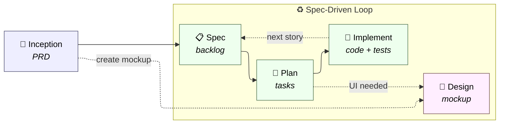

<div align="center">

# AIRchetipo

**Un team AI al tuo fianco, dall'idea al codice.**

Skill portabili per AI coding agent che trasformano il tuo assistente in una squadra di prodotto: analista, architetto, sviluppatore, tester, reviewer, designer — ognuno con il proprio ruolo e voce.

[](#)
[](#licenza)
[](#)
[](#)

[Quickstart](#quickstart) · [Skill](#skill) · [Come funziona](#come-funziona) · [Configurazione](#configurazione) · [FAQ](#faq)

</div>

---

## Perché AIRchetipo

Gli AI coding agent sono potenti, ma tendono a rispondere a prompt isolati senza un processo. **AIRchetipo introduce un flusso di lavoro ispirato ai team di prodotto reali**, con ruoli specializzati e artefatti persistenti (PRD, backlog, piani tecnici, mockup) che si passano da una fase all'altra.

- **Un processo, non un prompt.** Dalla discovery al code review, ogni fase ha la propria skill, i propri ruoli e i propri output.
- **Agnostico rispetto al tool.** Le stesse skill funzionano su Claude Code, Codex, Gemini CLI, OpenCode e GitHub Copilot.
- **Agnostico rispetto alla persistenza.** Gli artefatti vivono come file markdown nel repo oppure come issue su GitHub Projects, senza cambiare il modo in cui parli alle skill.
- **Autonomo quando serve.** Il flusso può essere guidato passo-passo oppure lanciato in autopilot sull'intero backlog.

---

## Quickstart

### 1. Installa AIRchetipo nel tuo progetto

**macOS / Linux**

```bash
curl -fsSL https://raw.githubusercontent.com/techreloaded-ar/AIRchetipo/main/install.sh | bash
```

**Windows (PowerShell)**

```powershell
irm https://raw.githubusercontent.com/techreloaded-ar/AIRchetipo/main/install.ps1 | iex
```

L'installer:
1. Scarica le skill da GitHub.
2. Mostra un menu interattivo per scegliere su quali AI tool installarle.
3. Copia ogni skill nella directory corretta del tool.
4. Crea `.airchetipo/config.yaml` con il connector scelto (`file` di default).

**Prerequisiti:**\
· `curl` + `unzip` su macOS/Linux (inclusi di default) \
· PowerShell 5.1+ su Windows \
· opzionale [`gh` CLI](https://cli.github.com/) autenticato se usi il connector GitHub.


### 2. Segui il flusso end-to-end

```
# Definisci il prodotto
> /airchetipo-inception
  → docs/PRD.md

# Genera il backlog iniziale
> /airchetipo-spec
  → docs/BACKLOG.md

# Pianifica una storia
> /airchetipo-plan US-001
  → docs/planning/US-001.md
  → docs/mockups/US-001/ (se UI)

# Implementa
> /airchetipo-implement US-001
  → codice + test + code review
  → storia in REVIEW nel backlog

```

Ad ogni passo la skill adotta la lingua della conversazione (rileva automaticamente italiano o inglese) e produce artefatti persistenti che alimentano la fase successiva.

---

## Come funziona

AIRchetipo è un set di **skill** (file markdown con istruzioni + reference) caricate dall'AI coding agent. Ogni skill incarna una fase del processo, ispirata alla metodologia **Spec-Driven Development**: la specifica è il contratto, e il ciclo `spec → plan → implement` si ripete per ogni slice di valore fino a completare il prodotto.



- **Inception** è one-shot: definisce il perimetro di prodotto.
- **Spec → Plan → Implement** è il ciclo iterativo: ogni giro arricchisce il backlog, pianifica la prossima storia e la implementa, fino al rilascio.
- **Design** viene invocato da `plan` quando una storia richiede UI nuova, o direttamente quando vuoi esplorare concept visivi.

### Il team

| Persona | Ruolo | Competenza principale |
|---|---|---|
| 🧭 **Andrea** | Product Manager | Vision, personas, scope dell'MVP |
| 💼 **Costanza** | Business Analyst | Requisiti funzionali e regole di dominio |
| 🔎 **Emanuele** | Requirements Analyst | Chiarisce acceptance criteria ed edge case |
| 📐 **Leonardo** | Architect | Soluzione tecnica e decisioni architetturali |
| 🔧 **Ugo** | Full-Stack Developer | Implementazione e task breakdown |
| 🧪 **Mina** | Test Architect | Strategia di test e coverage |
| 🔍 **Cesare** | Code Reviewer | Qualità, sicurezza, aderenza al piano |
| 🎨 **Livia** | UX Designer | Mockup e linguaggio visivo |

### Architettura connector

Le skill non gestiscono mai direttamente la persistenza. Il flusso è sempre:

1. La skill legge `.airchetipo/config.yaml` per sapere quale connector è attivo.
2. La skill carica `.airchetipo/contracts.md` (catalogo delle operazioni).
3. La skill carica `.airchetipo/connectors/{file|github}.md` (implementazione).
4. La skill chiama operazioni astratte (`READ: fetch_backlog_items`, `WRITE: save_plan`, `WRITE: transition_status`, …).

Questo significa che **puoi cambiare dove vivono i tuoi artefatti senza cambiare una riga nelle skill**. Oggi `file` e `github`, domani Linear, Jira o il tuo connector custom.

---

## Skill

| Skill | Scopo | Team | Trigger tipici |
|---|---|---|---|
| **`airchetipo-inception`** | Facilitazione interattiva della product discovery e generazione del PRD (visione, personas, MVP, architettura, requisiti funzionali). | 🧭 Andrea · 💼 Costanza · 🎨 Livia · 📐 Leonardo · 🔎 Emanuele | "definisci il prodotto", "idea di prodotto", "scrivi un PRD" |
| **`airchetipo-spec`** | Creazione del backlog iniziale dal PRD **oppure** aggiunta di nuove user story a un backlog esistente. Auto-rilevamento della modalità. | 🧭 Andrea · 🔎 Emanuele | "crea il backlog", "aggiungi una storia", "serve una feature per…" |
| **`airchetipo-design`** | Generazione di mockup frontend distintivi, isolati in `docs/mockups/`. Non tocca mai il codice applicativo. | 🎨 Livia | "fammi un mockup", "concept della dashboard", "landing page" |
| **`airchetipo-plan`** | Pianificazione tecnica di una user story: analisi, soluzione architetturale, task breakdown, strategia di test (con e2e quando serve). | 🔎 Emanuele · 📐 Leonardo · 🔧 Ugo · 🧪 Mina | "pianifica US-005", "come lo costruiamo?", "rompi la storia in task" |
| **`airchetipo-implement`** | Implementazione guidata della storia pianificata: codice, test, esecuzione della suite, code review rigorosa, fix loop, transizione a `REVIEW`. | 🔧 Ugo · 🧪 Mina · 🔍 Cesare | "implementa US-005", "esegui la prossima storia pronta" |

> La cartella `skills-extra/` contiene skill sperimentali riservate a **versioni future** (integrazioni con Figma Make, Vibe Kanban, e altre in lavorazione). Non sono ancora parte del flusso ufficiale.

---

## Configurazione

Dopo l'installazione, `.airchetipo/config.yaml` contiene i parametri del progetto:

```yaml
connector: file              # file | github

paths:
  prd: docs/PRD.md
  backlog: docs/BACKLOG.md   # solo per connector file
  planning: docs/planning/
  mockups: docs/mockups/
  test_results: docs/test-results/

workflow:
  statuses:
    todo: TODO
    planned: PLANNED
    in_progress: IN PROGRESS
    review: REVIEW
    done: DONE               # transizione manuale

github:                      # solo per connector github
  # owner: auto-detected
  # project_number: auto-detected
```

### Connector disponibili

#### `file` *(default)*

- Backlog in un singolo file markdown (`docs/BACKLOG.md`).
- Piani tecnici in `docs/planning/US-XXX.md`.
- Zero dipendenze esterne, tutto versionato con il tuo repo.

#### `github`

- Backlog come issue su un GitHub Project v2.
- Storie e task collegati tramite sub-issue.
- Transizioni di stato come campi custom del Project.
- Richiede `gh` CLI autenticato con permessi `repo` + `project`.

Il catalogo completo delle operazioni supportate da ogni connector è in [`.airchetipo/contracts.md`](.airchetipo/contracts.md).

---

## Filosofia

- **Il team è una lente, non un costume.** Ogni persona virtuale applica un angolo di analisi specifico; il loro "brief" è conciso e serve a rendere visibile il processo, non a generare verbosità.
- **Contesto lean.** Le skill leggono solo ciò che serve e in ordine: shared-runtime → contracts → connector → template. I file grandi si leggono chirurgicamente.
- **Output persistenti.** Ogni fase produce artefatti che vivono nel repo (o nel sistema connector). Il prossimo comando — o il prossimo giorno di lavoro — parte da lì.
- **Autonomia responsabile.** Le skill si fermano solo davanti a blocker reali (dipendenze esterne, ambiguità sul contratto). Adattamenti locali, fix meccanici e aggiornamenti di test non richiedono conferma.
- **Tool-agnostico e connector-agnostico.** Cambiare AI agent o sistema di tracking non deve riscrivere il processo.

---

## FAQ

<details>
<summary><b>Devo usare tutte le skill?</b></summary>

No. Ogni skill è utilizzabile in isolamento. Puoi partire direttamente da `airchetipo-plan` se hai già un backlog scritto a mano, o usare solo `airchetipo-design` per esplorare concept visivi.
</details>

<details>
<summary><b>Posso usare AIRchetipo su un progetto già esistente?</b></summary>

Sì. `airchetipo-spec` in modalità `extend-backlog` aggiunge storie a un backlog esistente. `airchetipo-plan` e `airchetipo-implement` lavorano su qualsiasi storia presente, indipendentemente da come è stata creata.
</details>

<details>
<summary><b>Cosa succede se il mio AI tool non supporta i subagent?</b></summary>

Le skill principali funzionano lo stesso, in modalità in-context. Solo `airchetipo-autopilot` richiede subagent isolati, perché orchestra più passi per storia.
</details>

<details>
<summary><b>Gli artefatti sono vincolati a un formato?</b></summary>

I template in `references/` sono opinati ma modificabili. Se usi il connector `github`, le issue seguono un layout preciso — vedi `.airchetipo/connectors/github.md`.
</details>

<details>
<summary><b>Perché i nomi italiani (Emanuele, Leonardo, Ugo, Mina, Cesare, Livia)?</b></summary>

AIRchetipo nasce in Italia e mantiene una voce riconoscibile: un team con nomi propri funziona meglio di "the analyst agent" / "the architect agent". Le skill parlano comunque nella lingua della conversazione (auto-detected).
</details>

<details>
<summary><b>Come si fa il debug di una skill?</b></summary>

Ogni skill dichiara quali reference carica. Attiva la modalità verbose del tuo AI tool e controlla che le operazioni connector (`READ:`, `WRITE:`) siano eseguite nell'ordine atteso. `.airchetipo/contracts.md` è la fonte di verità.
</details>

---

## Licenza

MIT © [techreloaded](https://github.com/techreloaded-ar)

---

<div align="center">

**Se AIRchetipo ti è utile, lascia una ⭐ al repo e condividilo con il tuo team.**

[Report bug](https://github.com/techreloaded-ar/AIRchetipo/issues) · [Richiedi feature](https://github.com/techreloaded-ar/AIRchetipo/issues) · [Discussions](https://github.com/techreloaded-ar/AIRchetipo/discussions)

</div>
