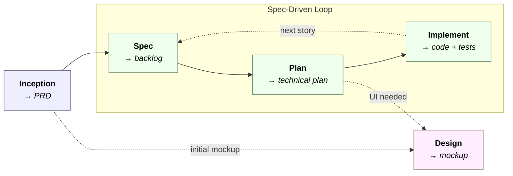

<div align="center">

# ARchetipo

**English** · [Italiano](README.it.md)

**An AI team at your side, from idea to finished product.**

A spec-driven workflow that turns your AI assistant into a product development squad: analyst, architect, developer, tester, reviewer, designer — each with their own role and voice.

[](#)
[](#license)
[](#)
[](#)

[Quickstart](#quickstart) · [Skills](#skill-details) · [How it works](#the-workflow) · [Configuration](#configuration) · [FAQ](#faq)

</div>

---

## Why ARchetipo

AI coding agents are powerful, but they tend to answer isolated prompts without a process. **ARchetipo introduces a workflow inspired by real product teams**, with specialized roles and persistent artifacts (PRD, backlog, technical plans, mockups) that flow from one phase to the next.

- **A process, not a prompt.** From discovery to code review, every phase has its own skill, its own roles, and its own outputs.
- **Tool-agnostic.** The same skills work on Claude Code, Codex, Gemini CLI, OpenCode, and GitHub Copilot.
- **Autonomous when needed.** The flow can be guided step-by-step or launched on autopilot across the whole backlog.

---

## Quickstart

### 1. Install ARchetipo in your project

**macOS / Linux**

```bash
curl -fsSL https://raw.githubusercontent.com/techreloaded-ar/ARchetipo/main/install.sh | bash
```

**Windows (PowerShell)**

```powershell
irm https://raw.githubusercontent.com/techreloaded-ar/ARchetipo/main/install.ps1 | iex
```

The installer:
1. Downloads the skills from GitHub.
2. Shows an interactive menu to pick which AI tools to install them on.
3. Copies every skill into the correct directory for each tool.
4. Creates the `.archetipo` folder with default configuration.

**Prerequisites:**
- `curl` + `unzip` on macOS/Linux (included by default)
- PowerShell 5.1+ on Windows
- optional [`gh` CLI](https://cli.github.com/) authenticated if you use the GitHub connector.

---

## The workflow

ARchetipo is a set of **skills** that compose a **workflow**. Each skill embodies one phase of the process, inspired by the **Spec-Driven Development** methodology: the `spec → plan → implement` cycle repeats continuously for each product increment.




- **Inception** (`/archetipo-inception`) is one-shot: it runs product discovery and produces a `PRD` (Product Requirements Document) covering vision, personas, MVP, architecture, and functional requirements.
- **Spec** (`/archetipo-spec`) opens the iterative loop. It generates the initial `Backlog` from the `PRD`, or extends it with new user stories.
- **Plan** (`/archetipo-plan`) plans a single story. It handles technical analysis, task breakdown, and test strategy. If the story requires new UI, it automatically invokes Design.
- **Implement** (`/archetipo-implement`) executes the plan. It produces code and tests, runs a rigorous code review, and hands the story off for user review.

- **Design** produces distinctive frontend mockups. It is invoked by `/archetipo-plan` when new UI is needed for a feature, or directly via `/archetipo-design` to explore visual concepts without touching the application code.

The `Spec → Plan → Implement` cycle repeats for every feature.

### The team

In every phase of ARchetipo, you will work with different AI personas, each with a clear role and set of skills.

| Persona | Role | Main expertise |
|---|---|---|
| 💎 **Andrea** | Product Manager | Vision, personas, MVP scope |
| 🧭 **Costanza** | Business Strategist | Brainstorming and discovery |
| 🔎 **Emanuele** | Requirements Analyst | Clarifies acceptance criteria and edge cases |
| 📐 **Leonardo** | Architect | Technical solution and architectural decisions |
| 🔧 **Ugo** | Full-Stack Developer | Implementation and task breakdown |
| 🧪 **Mina** | Test Architect | Test strategy and coverage |
| 🔍 **Cesare** | Code Reviewer | Quality, security, adherence to the plan |
| ✨ **Livia** | UX Designer | Mockups and visual language |

### Connector architecture

Skills don't know **where** artifacts live: they delegate persistence to a configurable **connector**.

- **Interface** → `.archetipo/contracts.md` (operations catalog)
- **Implementation** → `.archetipo/connectors/<name>.md` (how to run them)

Switching connectors = switching files, without touching the skills.

| Connector | Where artifacts land |
|---|---|
| `file` *(default)* | Local markdown files in the repo |
| `github` | Issues + GitHub Projects v2 |
| *custom* | Linear, Jira, Notion, … (extensible) |

---

## Skill details

| Skill | Purpose | Typical triggers |
|---|---|---|
| **`archetipo-inception`** | Interactive facilitation of product discovery and PRD generation (vision, personas, MVP, architecture, functional requirements). | "define the product", "product idea", "write a PRD" |
| **`archetipo-spec`** | Create the initial backlog from the PRD **or** add new user stories to an existing backlog. Mode is auto-detected. | "create the backlog", "add a story", "we need a feature for…" |
| **`archetipo-design`** | Generate distinctive frontend mockups, isolated in `docs/mockups/`. Never touches application code. | "make me a mockup", "dashboard concept", "landing page" |
| **`archetipo-plan`** | Technical planning of a user story: analysis, architectural solution, task breakdown, test strategy (including e2e when needed). | "plan US-005", "how do we build this?", "break the story into tasks" |
| **`archetipo-implement`** | Guided implementation of the planned story: code, tests, suite execution, rigorous code review, fix loop, transition to `REVIEW`. | "implement US-005", "run the next ready story" |

---

## Configuration

After installation, `.archetipo/config.yaml` holds the project parameters:

```yaml
connector: file              # file | github

paths:
  prd: docs/PRD.md
  backlog: docs/BACKLOG.md   # file connector only
  planning: docs/planning/
  mockups: docs/mockups/
  test_results: docs/test-results/

workflow:
  statuses:
    todo: TODO
    planned: PLANNED
    in_progress: IN PROGRESS
    review: REVIEW
    done: DONE               # manual transition

github:                      # github connector only
  # owner: auto-detected
  # project_number: auto-detected
```

### Available connectors

#### `file` *(default)*

- Backlog in a single markdown file (`docs/BACKLOG.md`).
- Technical plans in `docs/planning/US-XXX.md`.
- Zero external dependencies, everything versioned with your repo.

#### `github`

- Backlog as issues on a GitHub Project v2.
- Stories and tasks linked via sub-issues.
- State transitions as Project custom fields.
- Requires `gh` CLI authenticated with `repo` + `project` scopes.

The full catalog of operations supported by each connector lives in [`.archetipo/contracts.md`](.archetipo/contracts.md).

---

## Philosophy

- **Persistent output.** Every phase produces artifacts that live in the repo (or in the connector system). The next command, or the next working day, starts from there.
- **Responsible autonomy.** Skills only stop at real blockers (external dependencies, contract ambiguity). Local adjustments, mechanical fixes, and test updates don't require confirmation.
- **Tool-agnostic and connector-agnostic.** Switching the AI agent or tracking system shouldn't rewrite the process.

---

## FAQ

<details>
<summary><b>Do I have to use all the skills?</b></summary>

No. Every skill can be used in isolation. You can start directly from `archetipo-plan` if you already have a hand-written backlog, or use only `archetipo-design` to explore visual concepts.
</details>

<details>
<summary><b>Can I use ARchetipo on an existing project?</b></summary>

Yes. `archetipo-spec` adds stories to an existing backlog. `archetipo-plan` and `archetipo-implement` work on any existing story, regardless of how it was created.
</details>

<details>
<summary><b>Are artifacts bound to a specific format?</b></summary>

The templates in `references/` are editable. If you use the `github` connector, issues follow a precise layout — see `.archetipo/connectors/github.md`.
</details>

<details>
<summary><b>Why the Italian names (Emanuele, Leonardo, Ugo, Mina, Cesare, Livia)?</b></summary>

ARchetipo was born in Italy and keeps a recognizable voice: a team with proper names works better than "the analyst agent" / "the architect agent". Skills still speak the language of the conversation (auto-detected).
</details>

<details>
<summary><b>How do I debug a skill?</b></summary>

Every skill declares which references it loads. Turn on your AI tool's verbose mode and verify that connector operations (`READ:`, `WRITE:`) are executed in the expected order. `.archetipo/contracts.md` is the source of truth.
</details>

---

## License

MIT © [techreloaded](https://github.com/techreloaded-ar)

---

<div align="center">

**If ARchetipo is useful to you, leave a ⭐ on the repo and share it with your team.**

[Report bug](https://github.com/techreloaded-ar/ARchetipo/issues) · [Request feature](https://github.com/techreloaded-ar/ARchetipo/issues) · [Discussions](https://github.com/techreloaded-ar/ARchetipo/discussions)

</div>
