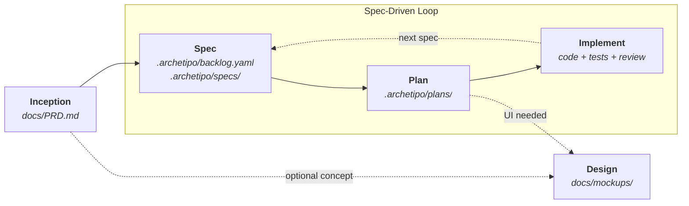

<div align="center">

# ARchetipo

**English** · [Italiano](README.it.md)

**From a rough product idea to reviewed code, with an AI product team that follows a real process.**

ARchetipo is a spec-driven workflow for AI coding agents. It gives your assistant a shared method, persistent project artifacts, and specialized roles for discovery, requirements, architecture, design, implementation, testing, and review.

[](#)
[](#license)
[](#)
[](#)

[Quickstart](#quickstart) · [Workflow](#workflow) · [Where to start](#where-to-start) · [CLI](#cli-and-commands) · [Configuration](#configuration) · [FAQ](#faq)

</div>

---

## Why ARchetipo

AI coding agents are fast, but a fast answer to an isolated prompt is not the same as a product process. **ARchetipo turns the agent into a disciplined product development squad**: it captures intent, writes specs, builds a backlog, plans each slice, implements it, tests it, and leaves durable artifacts behind.

- **A workflow, not prompt lore.** Every phase has a skill, a role, a contract, and an output that feeds the next step.
- **Spec-driven by default.** The `spec -> plan -> implement` loop repeats for each valuable slice until the product is done.
- **Persistent project memory.** PRD, backlog, spec files, plans, mockups, and test results live in your repo or in the configured connector.
- **Tool-agnostic.** The same product method works with Claude Code, Codex, Gemini CLI, OpenCode, and GitHub Copilot.
- **Language-aware.** Skills automatically follow the language of the conversation: write in English, get English artifacts; write in Italian, get Italian artifacts.

---

## Quickstart

### 1. Install the CLI once

```bash
npm install -g @techreloaded/archetipo
```

One global install works on macOS, Linux, and Windows. Update it later with:

```bash
archetipo update
```

> On Linux, if `npm install -g` reports permission problems, set a user-owned prefix once:
> `npm config set prefix ~/.npm-global`, then add `~/.npm-global/bin` to your `PATH`.

### 2. Initialize a project

```bash
cd my-project
archetipo init

# or non-interactive:
archetipo init --tool claude --connector file
```

`archetipo init` copies the ARchetipo skills into the selected AI tool directory, for example `.claude/skills/` or `.gemini/skills/`, and creates:

- `.archetipo/config.yaml`
- `.archetipo/shared-runtime.md`

After that, use the `/archetipo-*` skills inside your AI coding agent. The skills call the CLI in the background when they need to read or persist workflow artifacts.

---

## Workflow

ARchetipo implements Spec-Driven Development: the spec is the contract, and each product increment moves through `spec -> plan -> implement`.



| Step | Skill | Output | What happens |
|---|---|---|---|
| 1. Discovery | `/archetipo-inception` | `docs/PRD.md` | Defines product vision, scope, personas, functional requirements, and core architecture. |
| 2. Visual concept, optional | `/archetipo-design` | `docs/mockups/` | Creates isolated HTML/CSS mockups without touching application code. |
| 3. Backlog | `/archetipo-spec` | `.archetipo/backlog.yaml`, `.archetipo/specs/` | Converts the PRD into INVEST-compliant user stories or extends an existing backlog. |
| 4. Planning | `/archetipo-plan US-001` | `.archetipo/plans/US-001-plan.yaml` | Produces the technical solution, ordered tasks, dependencies, and test strategy. |
| 5. Code | `/archetipo-implement US-001` | Code, tests, review notes | Executes the plan, runs tests, performs review, and moves the spec toward human approval. |

### Workflow states

Specs move through standardized states. ARchetipo automates the loop, while final acceptance stays human.

| State | Meaning | Transition |
|---|---|---|
| `TODO` | Spec exists in the backlog and has not been planned yet. | Created by spec |
| `PLANNED` | Technical planning is complete. | Set by plan |
| `IN PROGRESS` | Implementation has started. | Set by implement |
| `REVIEW` | Code review and tests are complete; ready for human review. | Set by implement |
| `DONE` | Spec accepted and released. | Manual only |

### The AI team

ARchetipo personas are not theater; they are lenses that make the process visible.

| Persona | Role | Main expertise |
|---|---|---|
| Andrea | Product Manager | Vision, personas, MVP scope |
| Costanza | Business Strategist | Discovery, positioning, product hypotheses |
| Emanuele | Requirements Analyst | Acceptance criteria, edge cases, spec quality |
| Leonardo | Architect | Technical solution and architectural decisions |
| Ugo | Full-Stack Developer | Implementation and task breakdown |
| Mina | Test Architect | Test strategy and coverage |
| Cesare | Code Reviewer | Quality, security, adherence to the plan |
| Livia | UX Designer | Mockups and visual language |

---

## Where to start

Use this decision guide inside your AI coding agent:

| Question | If the answer is no | If the answer is yes |
|---|---|---|
| Do you already have a PRD? | Run `/archetipo-inception`. | Continue. |
| Do you want visual concepts before development? | Skip design for now. | Run `/archetipo-design`. |
| Do you already have a backlog of specs? | Run `/archetipo-spec`. | Continue. |
| Are the specs already `PLANNED`? | Run `/archetipo-plan US-001` on a `TODO` spec. | Continue. |
| Is a spec ready for implementation? | Plan it first. | Run `/archetipo-implement US-001`. |

For batch work, `/archetipo-autopilot` can run the plan and implement pipeline across eligible backlog specs with filters such as epic, priority, maximum spec count, or stop conditions.

---

## CLI and commands

ARchetipo uses a deterministic Go CLI, `archetipo`, for persistence and connector operations. In normal use you speak to the skills; the skills call these commands behind the scenes.

| Command | Purpose |
|---|---|
| `archetipo init` | Installs ARchetipo into the current project and creates `.archetipo/config.yaml` plus `.archetipo/shared-runtime.md`. |
| `archetipo view` | Starts a local Kanban view for `.archetipo/backlog.yaml`, `.archetipo/specs/`, and `.archetipo/plans/`. |
| `archetipo config show` | Initializes the connector and prints metadata. |
| `archetipo prd write [--file PRD.md]` | Saves PRD markdown from `--file` or stdin. |
| `archetipo spec list [--status STATUS]` | Reads backlog items and summary metadata, optionally filtered by status. |
| `archetipo spec add --file specs.yaml` | Creates or extends the backlog with specs (user-story body). |
| `archetipo spec show US-001` | Reads one spec and its tasks by code. |
| `archetipo spec next --status TODO` | Auto-selects the first eligible spec by status. |
| `archetipo spec plan US-001 --file plan.yaml` | Saves the implementation plan and moves the spec to `PLANNED`. |
| `archetipo spec start US-001` | Moves a planned spec to `IN PROGRESS`. |
| `archetipo spec review US-001 [--file note.md]` | Moves a spec to `REVIEW` and can attach a final comment. |
| `archetipo task done US-001 TASK-01` | Marks one task as completed. |
| `archetipo spec move US-001 --to review` | Reorders or moves a spec across workflow columns. |

The CLI reads `.archetipo/config.yaml` from the project to choose the active connector and artifact paths.

---

## Connectors

Skills never decide where artifacts live. They apply the shared runtime rules, call explicit CLI commands, and let the configured connector persist the result.

| Connector | Where artifacts live | Best for |
|---|---|---|
| `file` | Local project files under `.archetipo/` plus `docs/PRD.md` and `docs/mockups/` | Solo work, early product phases, offline workflows |
| `github` | GitHub Issues plus GitHub Projects v2 | Team tracking, cloud collaboration, project board workflows |

### `file` connector

- Backlog: `.archetipo/backlog.yaml`
- Spec documents: `.archetipo/specs/US-XXX.yaml`
- Plans: `.archetipo/plans/US-XXX-plan.yaml`
- PRD: `docs/PRD.md`
- Mockups: `docs/mockups/`
- Test results: `docs/test-results/`

No authentication is required. Everything is local and versionable.

### `github` connector

- Backlog items become GitHub Issues on a GitHub Projects v2 board.
- Spec tasks are created as linked sub-issues.
- Plans are added to the parent spec issue body.
- Status transitions are managed through Project custom fields.
- Requires the `gh` CLI authenticated with `repo` and `project` scopes.

The CLI architecture is extensible, but the built-in connectors today are `file` and `github`.

---

## Skill reference

| Skill | Purpose | Typical triggers |
|---|---|---|
| `archetipo-inception` | Facilitates product discovery and writes the PRD. | "define the product", "product idea", "write a PRD" |
| `archetipo-design` | Produces isolated frontend mockups in `docs/mockups/`. | "make a mockup", "dashboard concept", "landing page" |
| `archetipo-spec` | Creates or extends the backlog from product intent. | "create the backlog", "add a spec", "we need a feature for..." |
| `archetipo-plan` | Plans one spec with architecture, tasks, dependencies, and tests. | "plan US-005", "how do we build this?", "break this into tasks" |
| `archetipo-implement` | Executes a planned spec through code, tests, review, and handoff. | "implement US-005", "run the next ready spec" |
| `archetipo-autopilot` | Runs planning and implementation across multiple eligible specs. | "run everything", "autopilot the backlog", "implement all specs" |

---

## Configuration

`.archetipo/config.yaml` defines connector, paths, and workflow states. Missing keys are filled with official defaults.

```yaml
connector: file   # file | github

# Shared — used by every connector
paths:
  prd: docs/PRD.md
  mockups: docs/mockups/
  test_results: docs/test-results/

workflow:
  statuses:
    todo: TODO
    planned: PLANNED
    in_progress: IN PROGRESS
    review: REVIEW
    done: DONE   # no skill moves a spec to DONE automatically

# Used only when connector == file
file:
  backlog: .archetipo/backlog.yaml
  planning: .archetipo/plans/

# Used only when connector == github
github:
  # owner: auto-detected from repo
  # project_number: auto-detected from repo
```

Each connector reads only its dedicated section: configuring `file:` while the active connector is `github` (or vice versa) has no effect. Legacy configs with `paths.backlog` / `paths.planning` are refused at load time with a migration hint — there is no auto-migration.

---

## Philosophy

- **The team is a lens, not a costume.** Each persona applies a different kind of scrutiny so the work is easier to reason about.
- **Lean context.** Skills load only what they need: shared runtime, config, CLI contracts, then the specific templates for the phase.
- **Persistent output.** Every phase produces artifacts that survive the chat session and feed the next command.
- **Responsible autonomy.** Skills stop for real blockers: external dependencies, missing preconditions, or ambiguity that changes the contract.
- **Tool and connector agnostic.** Changing AI agent or tracking system should not rewrite the product process.

---

## FAQ

<details>
<summary><b>Do I need a PRD to start?</b></summary>

For a strong backlog, yes. If you do not have one yet, run `/archetipo-inception` first.
</details>

<details>
<summary><b>Can I add specs without rebuilding the whole backlog?</b></summary>

Yes. `/archetipo-spec` detects whether it is creating the initial backlog or extending an existing one.
</details>

<details>
<summary><b>Do design mockups become application code?</b></summary>

No. `/archetipo-design` writes isolated mockups in `docs/mockups/`. Implementation can use them as visual references, but the mockup files do not touch production code.
</details>

<details>
<summary><b>Can I use ARchetipo on an existing project?</b></summary>

Yes. Add or refine specs with `/archetipo-spec`, plan them with `/archetipo-plan`, then implement them with `/archetipo-implement`.
</details>

<details>
<summary><b>What if my AI tool does not support subagents?</b></summary>

The main skills still work in-context. Subagents improve separation of duties, but they are not required for the workflow.
</details>

<details>
<summary><b>How do I debug a skill?</b></summary>

Each skill declares the references it loads and the CLI commands it uses. Turn on your AI tool's verbose mode and check that the expected `archetipo ...` commands run in order.
</details>

---

## License

MIT © [techreloaded](https://github.com/techreloaded-ar)

---

<div align="center">

**If ARchetipo helps your team build with AI more deliberately, leave a star and share it.**

[Report bug](https://github.com/techreloaded-ar/ARchetipo/issues) · [Request feature](https://github.com/techreloaded-ar/ARchetipo/issues) · [Discussions](https://github.com/techreloaded-ar/ARchetipo/discussions)

</div>
